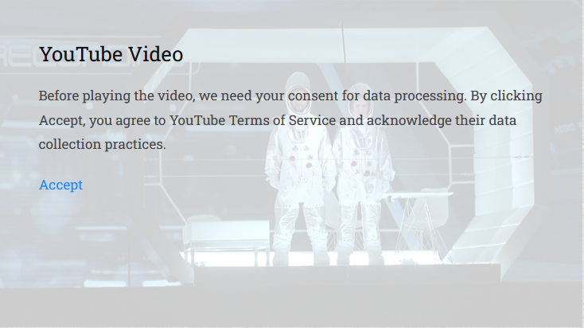

# TextformatterYouTubeConsent

ProcessWire Textformatter module used with 
<a href="https://processwire.com/modules/textformatter-video-embed/">TextformatterVideoEmbed</a> module to display privacy mesasge before embeding youtube videos.

### How to use

1. Istall <a href="https://processwire.com/modules/textformatter-video-embed/">TextformatterVideoEmbed</a> module.
2. Install TextformatterYouTubeConsent module in /site/modules/TextformatterYouTubeConsent/
3. In any Textarea field using CKEditor or TinyMCE select TextformatterYouTubeConsent for the Text formaters option.

You need to have 'TextformatterVideoEmbed' module installed, but on the field settings you should add only `TextformatterYouTubeConsent` in the **Text formaters** option.

Consent is stored in a session variable and this way we dont need a cookie consent.     
Mesage is displayed on top of the youtube video poster that is automatically pulled based on the video link.

